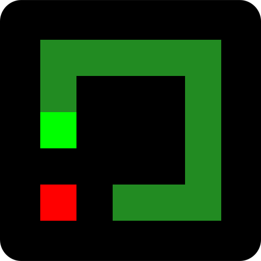
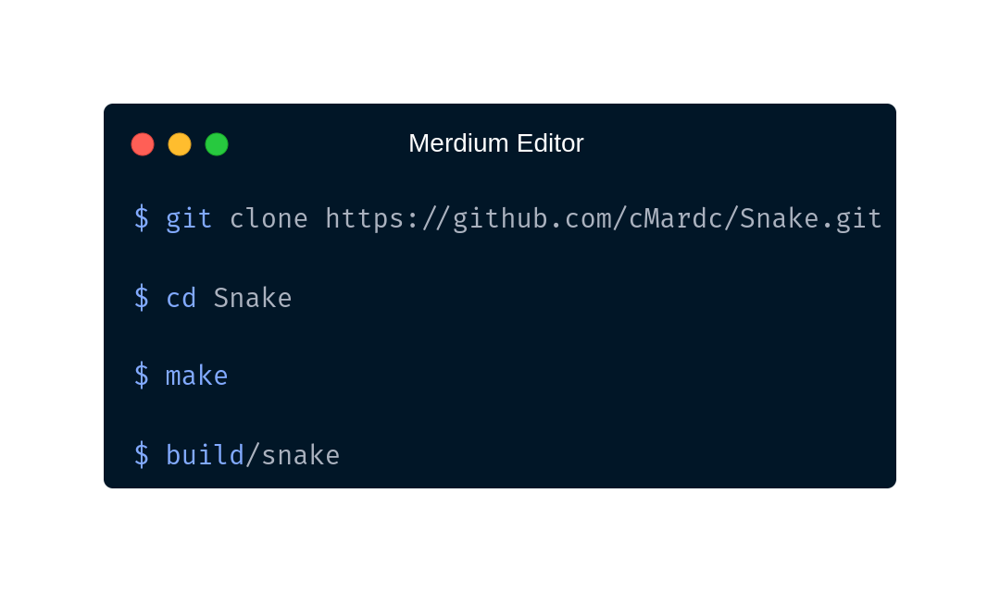

 
 

 

 
 

<h3>Snake
 Clone of old basic snake game made with C</h3>

<h2>Installation</h2>

<h3>Thanks for selecting us!</h3>
<h4>Made by ~cM</h4>

<h5>Other links : </h5>
<a href="https://discord.gg/5W4XtHkc6g">Discord</a>
<a href="https://github.com/cMardc">Github</a>
<a href="https://stackoverflow.com/users/21458468/merd-ceferzade">Stack Overflow</a>

